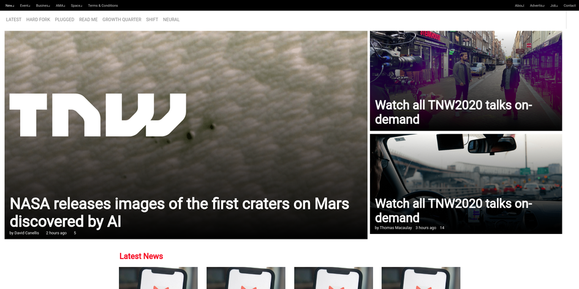
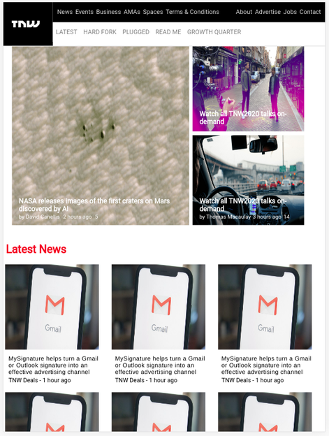
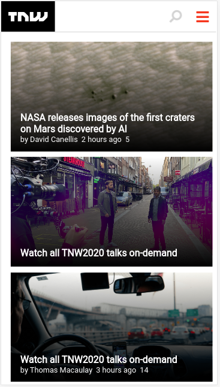

# The Next Web Clone - A Microverse Project

A clone of The Next Web landing page made for the Microverse FullStack program.
This is a responsive site and will scale as needed to different devices.

## Built With

- 
- 

## Live Demo

[Live Demo Link](https://imran5644.github.io/thenextweb_microverse)

##  Getting Started

To run the code simply download the repository by either cloning it or 
downloading it as Zip file. Then use the old trustable browser to open the HTML file.

## Authors

**Josias Alvarado**

- GitHub: [@pointerish](https://github.com/pointerish)
- Twitter: [@pointerish](https://twitter.com/pointerish)
- LinkedIn: [Josias Alvarado](https://www.linkedin.com/in/josias-alvarado-80901878/)

**Imran Yousaf**

- GitHub: [@imran5644](https://github.com/imran5644)
- LinkedIn: [Imran Yousaf](https://www.linkedin.com/in/imran-yousaf-8777297b/)

##  Contributing

Contributions, issues, and feature requests are welcome!

## Show your support

Give a ⭐️ if you like this project!

## License

This project is [MIT](./LICENSE) licensed.